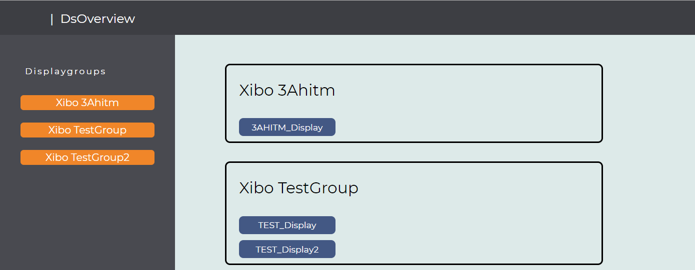

# DS_Overview
Github repo for Digital Signage Overview

 


Die Website DS_Overview dient als Übersicht - "Overview" für das Digital Signage. Es werden alle Displaygruppen und die dazugehörigen Displays dargestellt. Man kann sich von den Displaygruppen das Layout ansehen und was gerade auf den einzelnen Displays angezeigt wird.


# dsoverview

## Project setup
```
npm install vue
```

### Compiles and hot-reloads for development
```
npm run serve
```

### Compiles and minifies for production
```
npm run build
```

### Run your tests
```
npm run test
```

### Lints and fixes files
```
npm run lint
```

### Customize configuration
See [Configuration Reference](https://cli.vuejs.org/config/).
