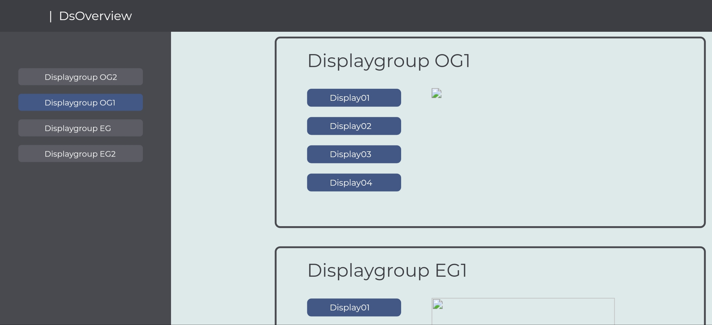
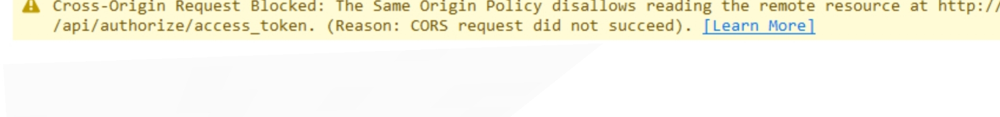

# Sachstandsbericht 2019_4_11Digital Signage Overview
### Zusammenfassung

Wir haben eine html Seite erstellt die später die von Xibo ausgelesenen Displaygroups und Displays anzeigt.

 

### Abruf der Daten von Xibo

Zurzeit haben wird an der Verbindung zu Xibo gearbeitet. Den dafür benötigten Code konnte man in Postman generieren lassen.

Leider sperrte der Browser die Abfrage und wir bekamen keinen Access Token, Der Fehler war ein [ Cros origin error ], das ist eine Schutzmaßnahme vom Browser um eine "Men in the middle Attac" zu verhindern.

 

Nach einer langen Recherche fanden wir heraus, dass das Hinzufügen von [ dataTyp = "jsonp" ] das Problem "löst"
Nun bekommen wir ein json Object zurück. Es kommt jedoch eine Fehlermeldung, dass keine Seite gefunden wurde.

### Postman

Mit Postman generieren wir den Code für API-Calls. Wir haben ein Tutorial befolgt um mit Postman auf die API zugreifen zu können. Weil wir eine [Collection] in Postman importiert haben, müssen wir den Code nicht selber schreiben. Wir müssen nur ergänzen, dass der responseType = json ist.

### Webcomponents 

Anstatt einer Ajax Abfrage mit JQeury werden wir jetzt Webcomponents verwenden.
Hier sind wir gerade dabei die Unterlagen durchzugehen.

